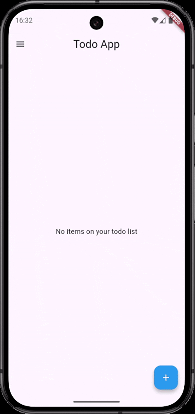

# Todo App

A clean and modern Todo app built with Flutter using "Material You design". It supports dark/light mode, persistent storage, and intuitive UI/UX.

##  Features

-  Responsive layout with Material 3 (Material You)
-  Dark & Light mode support
-  Persistent data with `SharedPreferences`
-  Dynamic task management
-  Modal bottom sheet for adding tasks
-  Navigation drawer for GitHub and contact

##  Screenshots (video preview)

<p align="center">
  
</p>


##  Getting Started

1. Clone this repo:
   ```bash
   git clone https://github.com/asvpxvivien/todoapp.git
   ```

2. Get dependencies:
   ```bash
   flutter pub get
   ```

3. Run the app:
   ```bash
   flutter run
   ```

##  Folder Structure

```
lib/
│
├── main.dart
├── mainScreen.dart
├── addTodo.dart
├── widgets/
│   └── todoList.dart
```

##  Dependencies

```yaml
dependencies:
  flutter:
    sdk: flutter
  shared_preferences: ^2.0.15
  url_launcher: ^6.1.5
```
